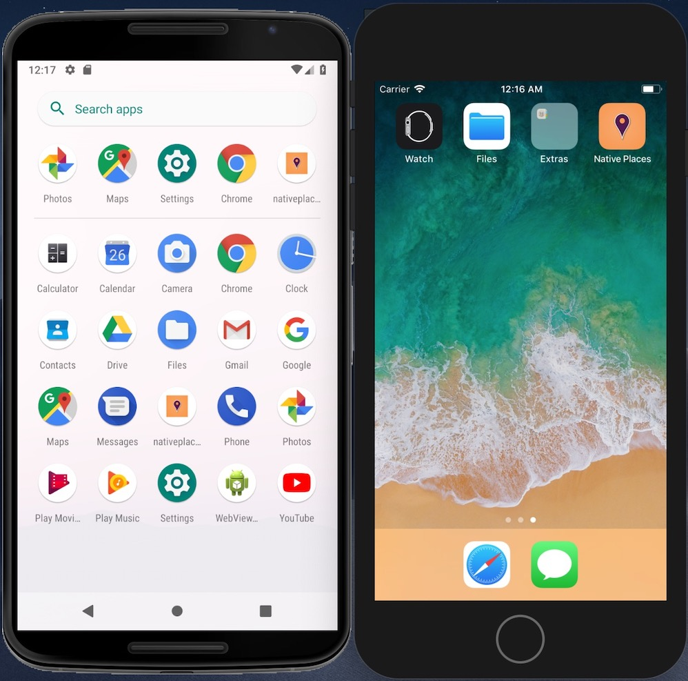
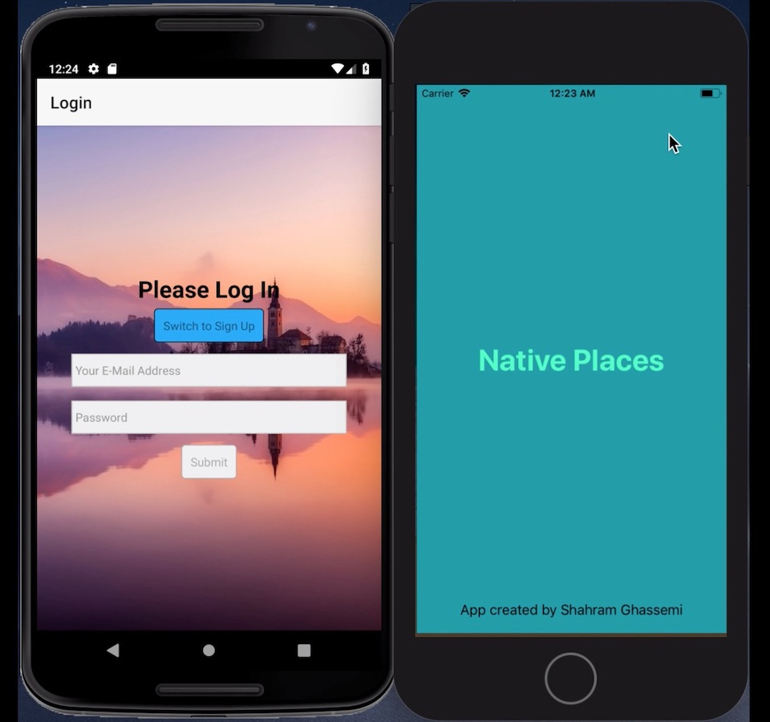

# Native-Places
Native Places is a React Native mobile application for IOS and Android where users can share amazing pictures and the location where they took them. It has user authentication, the ability to use and view a map, take pictures with a camera, and share their place for the world to see.

 

  
