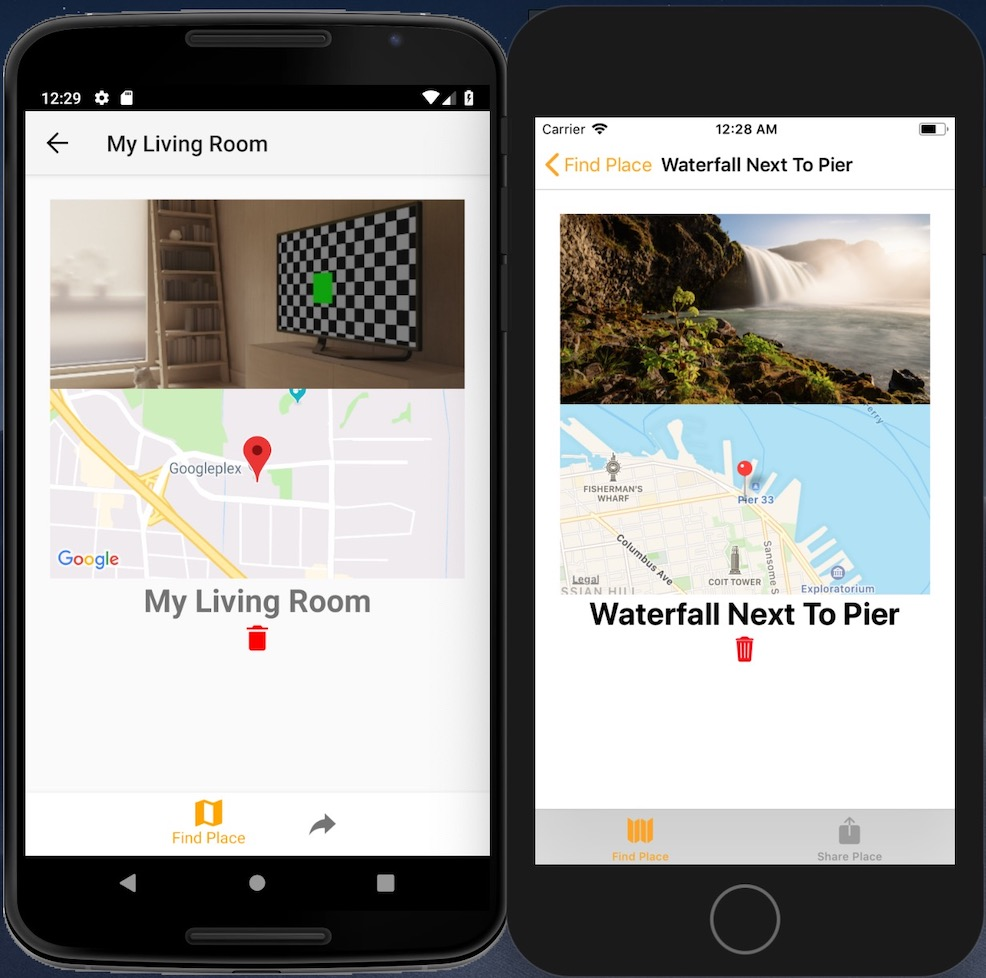

# Native-Places
Native Places is a React Native mobile application for IOS and Android where users can share amazing pictures and the location where they took them. It has user authentication, the ability to use and view a map, take pictures with a camera, and share their place for the world to see.

Technologies used: 
React 16.5 
React-Native 57.1 
Firebase for cloud functions, back-end storage, database and authentication 
FlexBox for positioning elements 

Third Party Packages: 
React-Native-Vector-Icons (Ionicons) 
React-Native-Image-Picker 
React-Native-Navigation 
React-Native-Maps 

APIs 
Google Maps API 
Dimensions APIs 
Platform API 
Animated API 

 

  

When first opening the app, users are greeted with a Login page. They may log in if they have already signed up, or may click on the Switch to Sign Up button to create an account. Users have to enter a valid email (Regex validation will check for that), and their password input has to match their confirm password input. The submit button will be disabled until every condition has been fulfilled.

  

After creating an account, users land on the Find Place screen. They can click on Find Places to see all the places other people have shared as well as any places they have shared themselves. If the user would like to share a place, they can simply click on the Share Place tab on the bottom right of the screen to land on the Share Place Screen.

 

Once on the Share Place screen, users will need to fill all fields in order to be able to share a place. First, they will need to pick an image. This can be done by choosing a picture from the phone's photo library, or by taking a picture using the phone's camera.

  

For demonstration purposes, I chose to pick a photo from the library on the iPhone (on the right) and chose to take a photo on the Android phone on the left.

  

After picking the image, the user can then drop a pin on the map or may click on the Locate Me button which will drop a pin on the exact location they are using their phone in the world.

    

Users can then scroll down to the bottom of the screen and enter a name for the place they would like to share. Afterwards, they can simply click on Share The Place! button to share the place for the world to see.

  

They are then redirected to the Find Place screen once again. Upon clicking on Find Places, an animation will occur and then all the places people have shared will fade into the screen.

  

Users can click on the different places that people have shared which will then display the image and location together for viewing. They can also remove places that they shared if they choose to do so.

  
