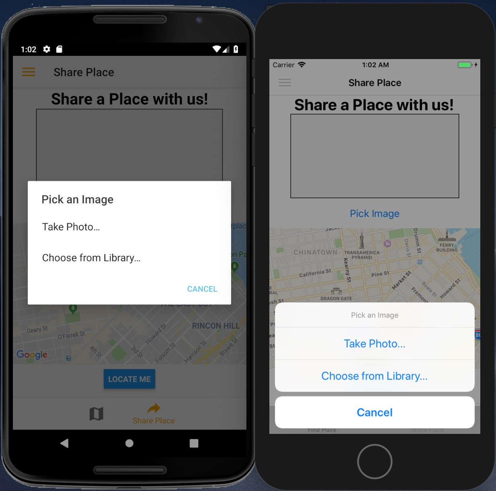

# Native-Places
Native Places is a React Native mobile application for IOS and Android where users can share amazing pictures and the location where they took them. It has user authentication, the ability to use and view a map, take pictures with a camera, and share their place for the world to see.

Technologies used: 
React 16.5 
React-Native 57.1 
Firebase for cloud functions, back-end storage, database and authentication 
FlexBox for positioning elements 

Third Party Packages: 
React-Native-Vector-Icons (Ionicons) 
React-Native-Image-Picker 
React-Native-Navigation 
React-Native-Maps 

APIs 
Dimensions APIs 
Platform API 
Animated API 

 

  

When first opening the app, users are greeted with a Login page. They may log in if they have already signed up, or may click on the Switch to Sign Up button to create an account.

  

After creating an account, users land on the Find Place screen. They can click on Find Places to see all the places other people have shared as well as any places they have shared themselves. If you would like to share a place, simply click on the Share Place tab on the bottom right of the screen to land on the Share Place Screen.

 

  
